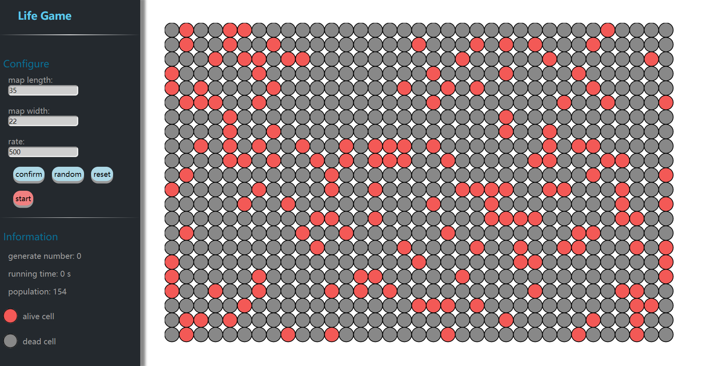

# LIFE GAME
这是一个简单的课程项目作业演示，用p5.js展示生命游戏的演变。

It's a course project and just made for fun. You can [click here to play!](https://getianao.github.io/life-game/ )

## 关于游戏

生命游戏是模拟细胞生成过程的游戏。一些细胞可能会死亡而一些细胞可以存活。它取决于自然选择的环境。在不同的初始情况下，细胞可以以不同的方式生成，这将呈现出惊人的图形。

The life game is the game to simulate the cell's generating processing. Some cells may die while some cells can survive. It depend on the environment according to natural selection. In a different initial situation, cells can generate in different way which will present an amazing graphic.

## 游戏规则

细胞的状态取决于该细胞周围的细胞数量：

如果数量小于2，则单元格将死亡。

如果数量是2，则单元格将处于活动状态。

如果数量为3，则单元格状态不会改变。

如果数量超过3，则该单元格将死亡。

The cell's state is depend on the number of cells around this cell.

If the number is less than 2, the cell will be dead.

If the number is 2, the cell will be alive.

If the number is 3, the cell state won't change.

If the number is more than 3, this cell will be dead.

## feature

- [x] 设置地图长宽
- [x] 设置迭代速率
- [x] 手动/随机添加细胞
- [x] 细胞实时信息查看

## 界面

### BY THE WAY
I made this in my spare time and it may exist some bugs, issue and star are welcome. THANKS!

## LICENSE

> Copyright 2019 getianao
>
> Licensed under the Apache License, Version 2.0 (the "License"); you may not use this file except in compliance with the License. You may obtain a copy of the License at
>
> http://www.apache.org/licenses/LICENSE-2.0
>
> Unless required by applicable law or agreed to in writing, software distributed under the License is distributed on an "AS IS" BASIS, WITHOUT WARRANTIES OR CONDITIONS OF ANY KIND, either express or implied. See the License for the specific language governing permissions and limitations under the License.